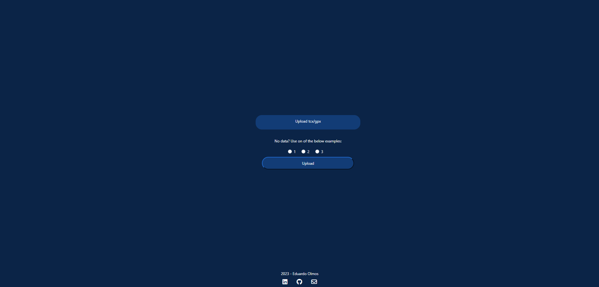
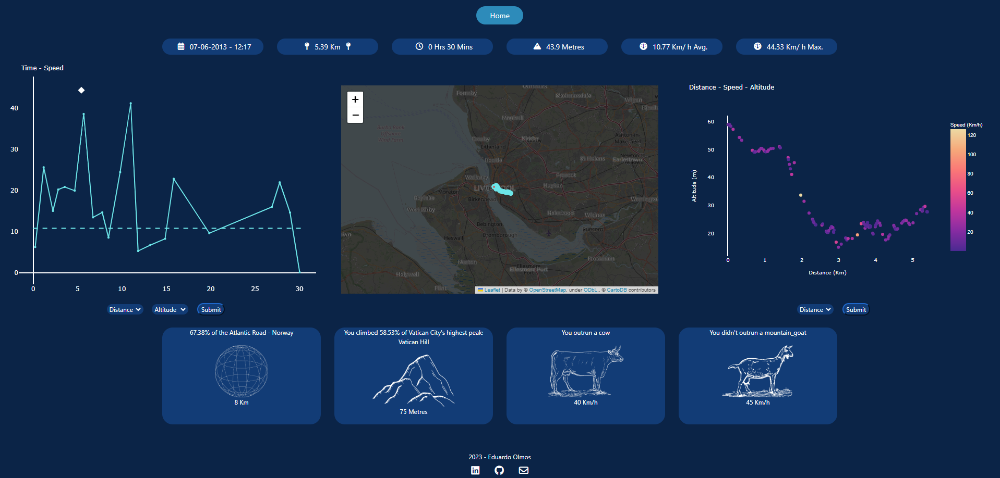
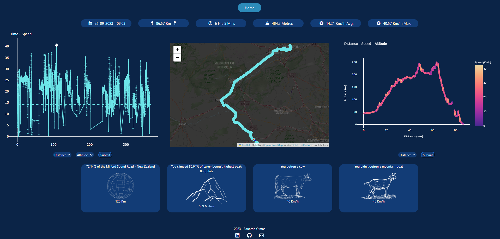
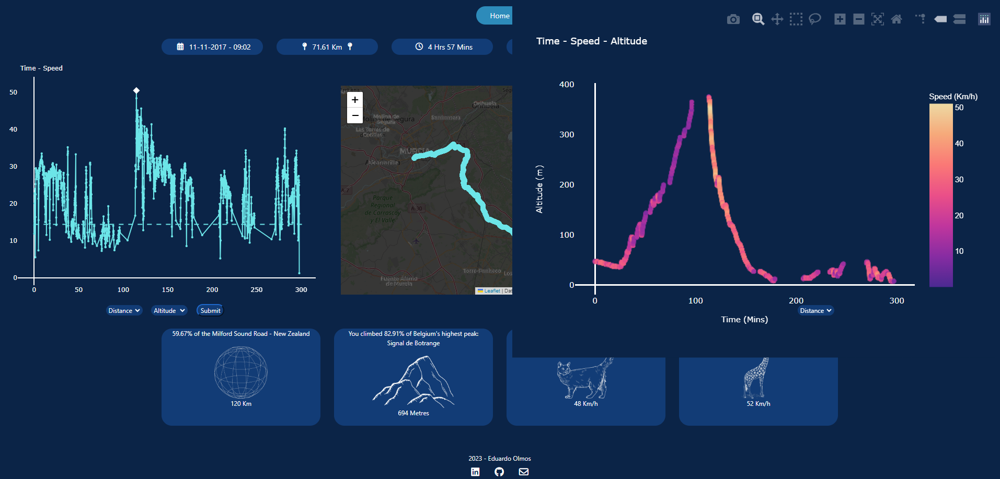
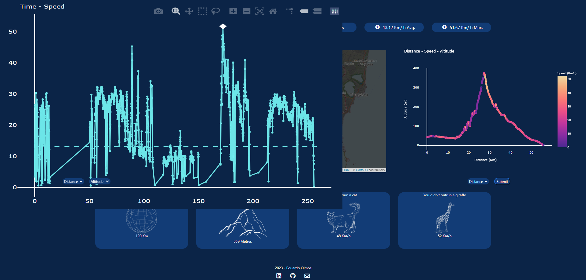
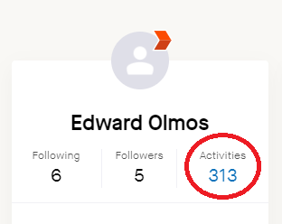
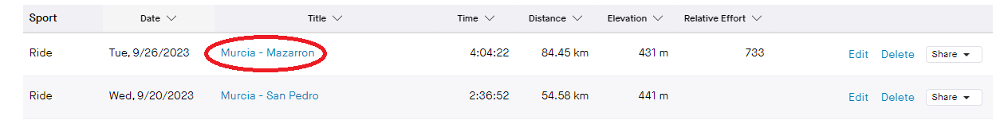
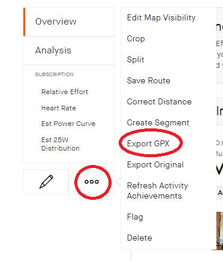

# Cycling Dashboard

This cycling dashboard is an interactive web application that allows you to create personalized cycling dashboards from .tcx or .gpx files, which you can download from various sources, including Strava. 

With the cycling dashboard, you can visualize and analyze your cycling data in a user-friendly and informative way.

You are also able to interact with the the dashboard, and manipulate the graphs.


**There are two options to view use this, the first is to clone this repo. It is also hosted online with Heroku at this [link](https://cycling-dashboard-3d5bfb76be1b.herokuapp.com/) (please bear in mind that load times are longer, especially for maps).**

## Contents
- [Demo](#demo)
- [Features](#features)
- [Getting Started](#getting-started)
   - [Requirements](#requirements)
   - [Installation](#installation)
   - [Sourcing data](#sourcing-data)
      - [Strava](#strava)
   - [Usage](#usage)
- [How it works](#how-it-works)
- [Contributing](#contributing)
- [Roadmap](#roadmap)

## Demo
Screenshots from different rides:
Home screen>


Ride 1:

Ride 2:


Ride 3 (with hover zoom on graph)


Ride 4 (with hover zoom on graph)



## Features

- **Dashboard Creation**: Upload .tcx, .gpx files from your cycling activities, or use one of the example rides, and generate a comprehensive dashboard.

- **Data Visualization**: Utilizes Plotly for creating interactive and visually appealing charts, such as time-speed graphs and altitude-distance-speed graphs.

- **Mapping Your Ride**: Uses Folium to display your cycling route on an interactive map.

- **Data Preparation**: Leverages Pandas for data preprocessing, cleaning, and feature engineering from your raw cycling data.

## Getting Started

### Requirements

- Python 3.x
- Flask
- Flask-Bootstrap
- Folium
- gpxpy
- Plotly
- Pandas


### Installation

1. Clone this repository
2. Change to the project directory:
3. Install the required packages:
4. Run the application

   ```bash
   python api/main.py

### Sourcing Data

#### Strava
1. Head to www.strava.com and log in
2. On the dashboard, click here on the left:
   
3. Select an activity:
   
4. Click to open the menu, and export GPX:
   

### Usage

1. **Data**: On the web application, upload your .tcx or .gpx file in the upload OR, if you do not have data, choose one of the three radio selections to see sample data.

2. **Explore Your Data**: Interact with the generated dashboard:
   - **Key Statistics**: View the key statistics from the ride, such as date and time, total distance, total time, total ascent and average and maximum speeds.
   - **Interactive Charts**: Two charts with adjustable options. Use the dropdowns underneath to change the x and y axis in the left-most chart, and select either the distance or time for the x axis on the right-most chart.
   - **Interactive Map**: View an interactive map with your route plotted.
   - **Comparisons**: See how your ride compares against differents routes, peaks and animals.
   

# How it works
The data provided by a .tcx or .gpx file contains multiple entries for each of the following:
- Timestamp
- Latitude
- Longitude
- Altitude

From this, it is created into a Pandas DataFrame and the data is prepared. With some feature engineering, the end DataFrame contains columns on:
- Timestamp
- Latitude
- Longitude
- Altitude
- Total Distance in M and Km
- Time difference between each section
- Altitude difference between each section
- Speed in that segment
- Total time elapsed in minutes


## Contributing
I would welcome contributions on the project. 

As I'm putting it out, there are bound to be a number of bugs that I haven't thought about. Please let me know if you find any, or go at it!

I've mentioned a couple of things I'll focus on next in the [Roadmap](#roadmap) section below.

## Roadmap

Things I'll focus on next, in no particular order:

- Adding a light theme
- Adding other themes
- Handling AJAX requests for the charts
- Improving design
- Adding a calorie counting function, and incorporate it into the stats